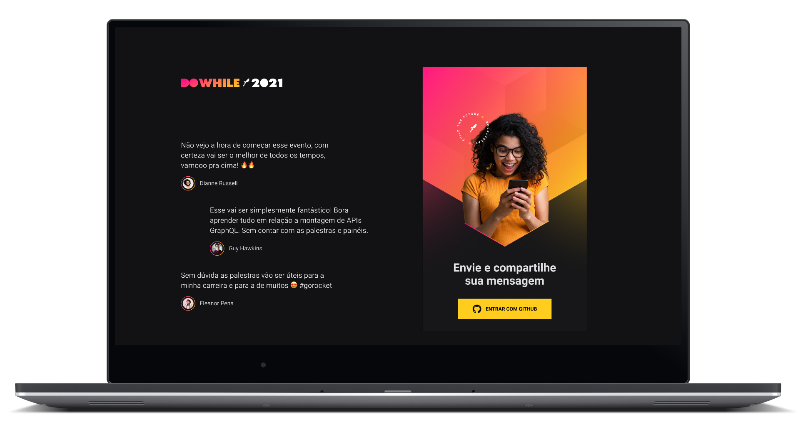
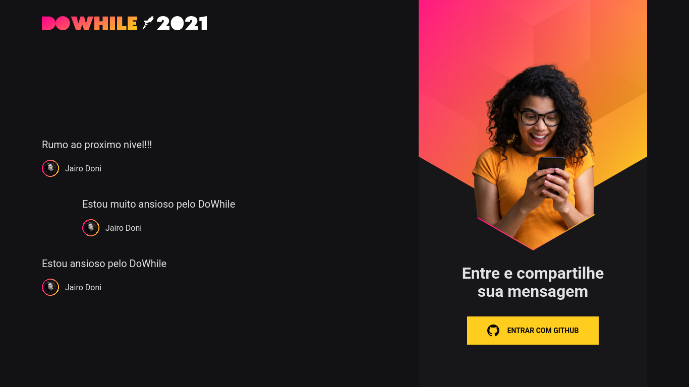
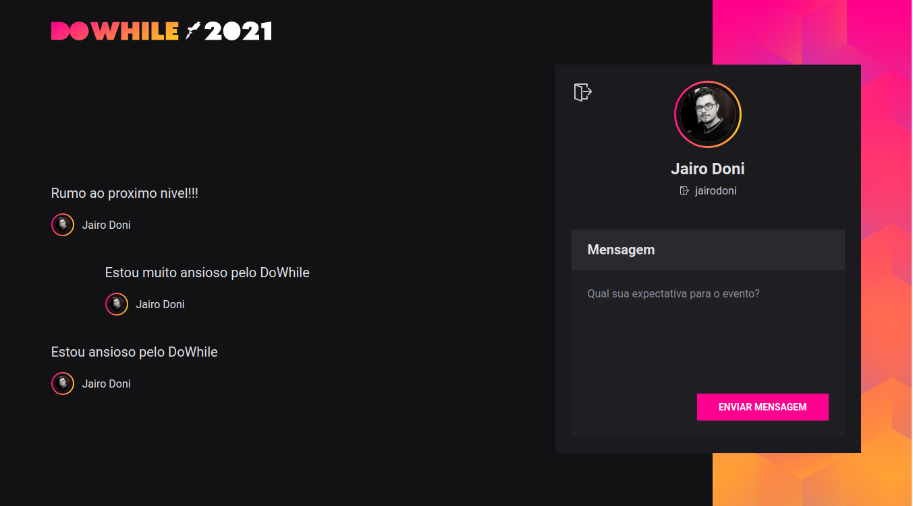

<div 
  align="center"
  style="
    background: #251e2b;
    border-radius: 1.5rem;
    display: flex;
    alight-itens:center;
    justify-content: center;
    flex-direction: column;
    padding: 10px 60px;
    margin: 10px 20px;
    border: 2px solid #444444;
  ">
  
  <h1 align="center">
      
  </h1>  
  
   [](LICENSE.md) 
    
     
   
  
  
  

</div>

<div align="center">

<br>

<p align="center">
  <strong>
      <a href="#-projeto">Projeto</a> &nbsp;|&nbsp; 
  </strong>
  <strong>
      <a href="#-layout">Layout</a> &nbsp;|&nbsp; 
  </strong>
  <strong>
      <a href="#-tecnologias">Tecnologias</a> &nbsp;|&nbsp; 
  </strong>
  <strong>
      <a href="#-como-executar-o-projeto">Executando</a> &nbsp;|&nbsp; 
  </strong>
  <strong>
      <a href="#-referências">Referências</a> &nbsp;|&nbsp; 
  </strong>
  <strong>
      <a href="#-autor">Autor</a> 
  </strong>
</p>

<p align="center">
  
</p>
</div>

---

## **💻 Projeto**

DoWhile foi um projeto desenvolvido durante o evento "NLW Heat" com aulas produzidas pela **[Rocketseat][rocketseat_site]**. DoWhile é uma plataforma para as pessoas interagirem e comentarem sobre o que esperam do evento "DoWhile 2021", o mesmo permite fazer login social com github para com isso criar uma conta e poder interagir com o pessoal.

---

## **🔖 Layout**

Você pode visualizar o layout do projeto no formato através [desse link](<https://www.figma.com/file/QLdZ6Fk8iwNV6XlUukyrmb/%5BNLW-Heat---Mission%3A-Impulse%5D-DoWhile2021-(Community)?node-id=0%3A1>). Lembrando que você irá precisar ter uma conta no [Figma](http://figma.com/).

#### **Web**

  <div>
    <br/>
    
    <br/>
    <br/>
    
  <div>

---

## **💻 Tecnologias**

#### **Server** ([Node][node])

- **[Typescript][typescript]**
- **[Prisma][prisma]**
- **[Socket.io][socket.io]**
- **[JWT (JSON Web Token)][jwt]**
- **[Express][express]**

> \* Veja o arquivo <kbd>[package.json](./server/package.json)</kbd>

#### **Website** ([React][react])

- **[Typescript][typescript]**
- **[Socket.io (Client)][socket.io_client]**
- **[Sass][sass]**

> \* Veja o arquivo <kbd>[package.json](./client/package.json)</kbd>

#### **Mobile** ([React Native][reactnative])

- **[Typescript][typescript]**
- **[Expo][expo]**
- **[Socket.io (Client)][socket.io_client]**
- **[Moti][moti]**

> \* Veja o arquivo <kbd>[package.json](./mobile/package.json)</kbd>

#### **Utilitários**

- Editor: **[Visual Studio Code][vscode]**
- Renderizador Mobile: **[Expo Play Store][expo_app]**
- Markdown: **[StackEdit][stackedit]**, **<kbd>[Markdown Emoji][markdown_emoji]</kbd>**

---

## **🚀 Como executar o projeto**

### Configurações Iniciais

Primeiro, você precisa ter o **<kbd>[NodeJS](https://nodejs.org/en/download/)</kbd>** instalado na sua máquina.

Se você estiver utilizando o **Linux**, você pode optar por instalar o **Node** através do gerênciador de versões <kbd>[asdf]</kbd> para facilitar o processo de mudança da versão do **Node**, quando for necessário.

Você pode optar também por utilizar o **yarn** no lugar do **npm**. Você pode instalar clicando nesse <kbd>[link][yarn]</kbd>, ou através do <kbd>[asdf]</kbd>.

Após ter o **Node** instalado, siga os proximos passos:

### - Usando o terminal acesse a pasta do **[server](./mobile)** e execute os seguintes comandos:

```sh
# Instale as dependencias:
$ npm install

# ou

$ yarn

# Execute o server:
$ npm run dev

    OU

$ yarn dev
```

<br/>

### - Usando o terminal acesse a pasta do **[client](./client)** e execute os seguintes comandos:

```sh
# Instale as dependencias:
$ npm install

# ou

$ yarn

# Executando website:
$ npm run dev

    OU

$ yarn dev
```

> Se o browser não abrir automaticamente, acesse: http://localhost:3000.

<br/>

### - Usando o terminal acesse a pasta do **[mobile](./mobile)** e execute os seguintes comandos:

```sh
# Primeiro instale o "aplicativo expo" para poder visualizar as telas.
# Em seguida instale as dependencias:
$ npm install

# ou

$ yarn

# Executando Aplicativo:

$ expo start
```

> Use o QRcode para copilar as telas em seu celular.
> <br/>

### - Crie um "OAuth App" na sua conta do Github para usar o login social, siga as instruções de a cordo com a versão que estiver testando:

- [Web]('./client')
- [Mobile]('./mobile')

---

## **📚 Referências**

- [Blog Rocketseat][rocketseat_blog]
- [Rocketseat][rocketseat_plataforma]
- [ReactJS][react_doc] | [ReactJS pt-BR][react_doc_ptbr]
- [Node.js][node]

## **👨‍🚀 Autor**

<a href="https://github.com/jairodoni">
 
  <br />
  <sub>
    <b>Jairo Doni Prudente Junior</b>
  </sub>
</a>
<br />

👋 Entre em contato!

[](https://www.linkedin.com/in/jairodoni/)
[](mailto:jairo.doni97@gmail.com)

## **📝 Licença**

Esse projeto está sob a licença MIT. Veja o arquivo [LICENSE](LICENSE.md) para mais detalhes.

<!-- Referencias -->

[rocketseat_blog]: https://blog.rocketseat.com.br/
[rocketseat_plataforma]: https://app.rocketseat.com.br/
[rocketseat_site]: https://rocketseat.com.br/

<!-- Techs -->

[react]: https://reactjs.org/
[react_doc]: https://reactjs.org/docs/getting-started.html
[react_doc_ptbr]: https://pt-br.reactjs.org/docs/getting-started.html
[reactnative]: https://reactnative.dev
[moti]: https://moti.fyi
[expo]: https://expo.dev
[expo_app]: https://play.google.com/store/apps/details?id=host.exp.exponent&hl=pt_BR&gl=US
[node]: https://nodejs.org/en/
[prisma]: https://www.prisma.io
[jwt]: https://jwt.io
[express]: https://expressjs.com/pt-br/
[axios]: https://github.com/axios/axios
[socket.io]: https://socket.io
[socket.io_client]: https://socket.io/docs/v4/client-api/
[sass]: https://sass-lang.com
[vscode]: https://code.visualstudio.com/
[typescript]: https://www.typescriptlang.org/
[asdf]: https://github.com/asdf-vm/asdf
[yarn]: https://classic.yarnpkg.com/en/docs/install/#debian-stable
[stackedit]: https://stackedit.io
[markdown_emoji]: https://gist.github.com/rxaviers/7360908
