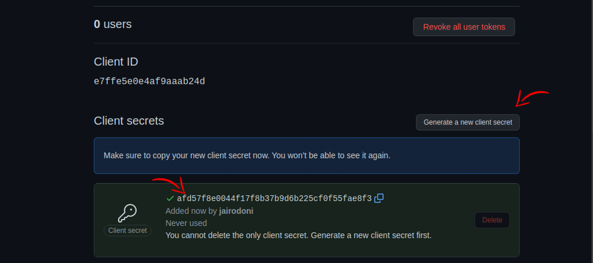

# **Configurando OAuth App pra Web:**

#### OBS: Caso vc ja tenha criado um para Mobile, substitua as seguintes informações no OAuth App:

> Homepage URL: https://localhost:3000  
> Authorization callback URL: https://localhost:3000

 

## Para configurar o OAuth App você deve seguir os seguintes passos

---

 

Acesse o seguinte endereço:

#### **https://github.com/settings/developers**

 

Selecione a aba OAuth Apps:

 
 

Preencha o formulario com as seguintes informações:

 
 

Tanto no mobile quanto no server é necessário o uso de algumas variaveis de ambiente contidas em um arquivo .env, dentre as variaveis o Client ID, o Client ID você tira do OAuth que vc acabou de criar:

 
 

Você deve adicionar o Client ID na pasta **[client](./.env.local.example.txt)**, **[mobile](../mobile/enviroment.js.txt)** e na **[server](../server/.env.example.txt)**. Na pasta server você deve adicionar tambem uma chave secreta gerada no OAuth App. Você não tera acesso a ela novamente então copie cole no .env da pasta **[server](../server/.env.example.txt)**:

 
 

Com a aplicação configurada, teste ela e o login social com o github.
