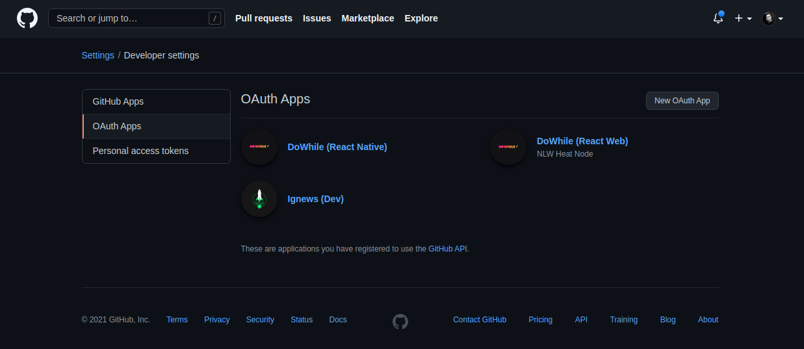
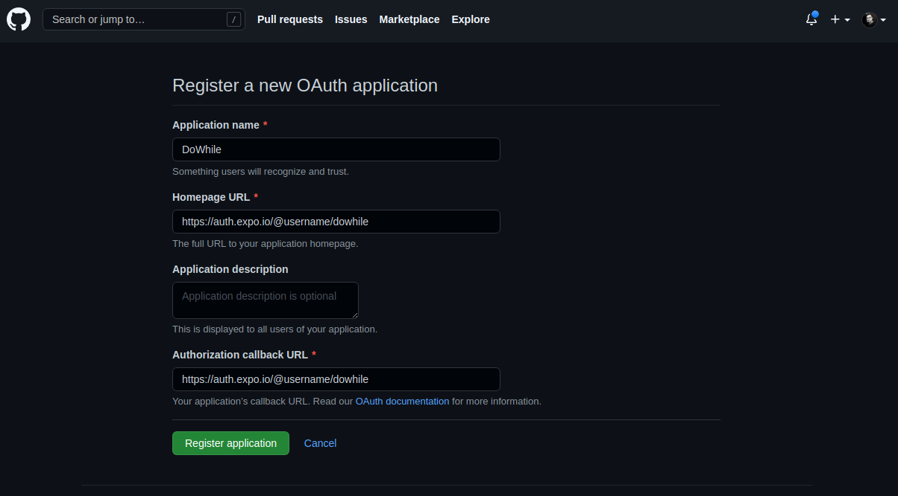
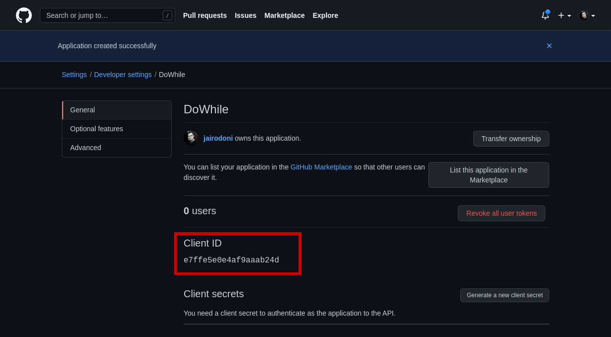
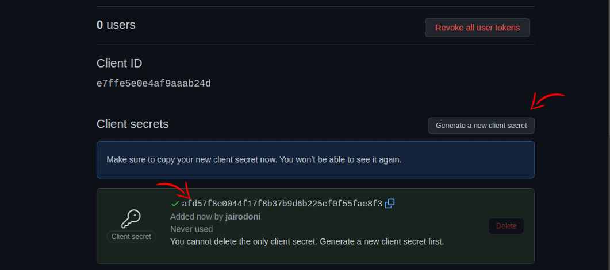

# **Configurando OAuth App pro Mobile:**

#### OBS: Caso vc ja tenha criado um para Web, substitua as seguintes informações no OAuth App:

> Homepage URL: https://auth.expo.io/@username/dowhile  
> Authorization callback URL: https://auth.expo.io/@username/dowhile

#### \* **Substitua o username da URL acima para o username da sua conta Expo, caso você não tenha conta no site da Expo acesse [https://expo.dev](https://expo.dev) para criar uma.**

 
 

## Para configurar o OAuth App você deve seguir os seguintes passos

---

 

Acesse o seguinte endereço:

#### **https://github.com/settings/developers**

 

Selecione a aba OAuth Apps:

 
 

Preencha o formulario com as seguintes informações:

 
 

> \* **Substitua o username da URL acima para o username da sua conta Expo, caso você não tenha conta no site da Expo acesse [https://expo.dev](https://expo.dev) para criar uma.**

 

Tanto no mobile quanto no server é necessário o uso de algumas variaveis de ambiente contidas em um arquivo .env, dentre as variaveis o Client ID, o Client ID você tira do OAuth que vc acabou de criar:

 
 

Você deve adicionar o Client ID na pasta **[mobile]('../web/.env.example.txt')**, **[client]('../web/.env.local.example.txt')** e na **[server]('../server/.env.example.txt')**. Na pasta server você deve adicionar tambem uma chave secreta gerada no OAuth App. Você não tera acesso a ela novamente então copie cole no .env da pasta **[server]('../server/.env.example.txt')**:

 
 

Com a aplicação configurada, teste ela e o login social com o github.
